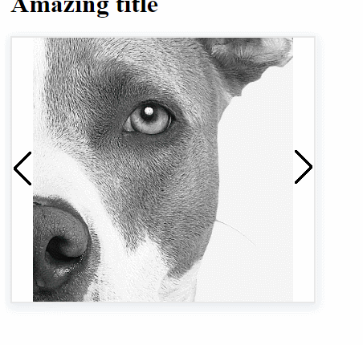
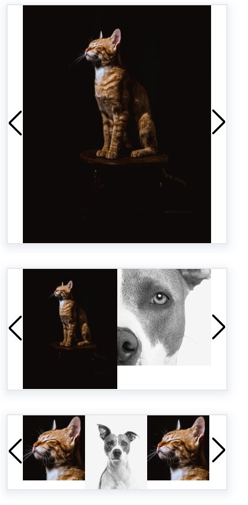

This component was bootstrapped with [Direflow](https://direflow.io).

# Content Scroller - Web Component
> An image carousel that automatically changes images. Up to 12 image urls can be placed as attributes.
Define containing div's width, images will scale to that width. For best performance use images that have the same aspect ratio

Usage:

```html
<script src="./direflowBundle.js"></script>
<div class="containing-div">
<content-scroller visibleDivs="2" image1="hreftoimage1" image2="hreftoimage2" etc...></content-scroller>
</div>
```
visibleDivs will change the amount of images shown next each other. Supports values 1-3.

Demo gif:

> 
> 
